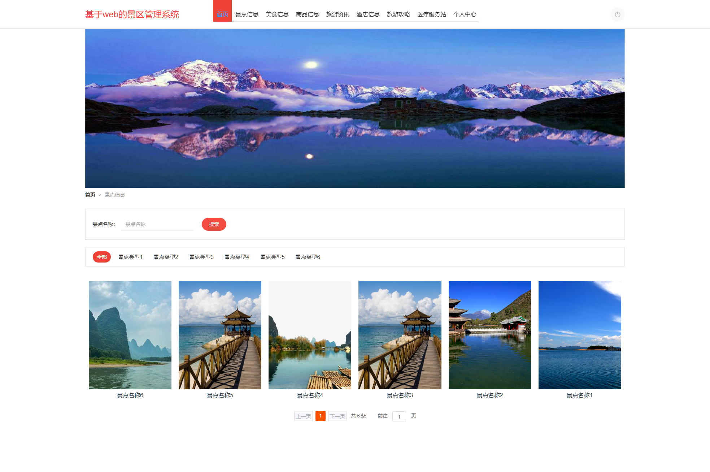
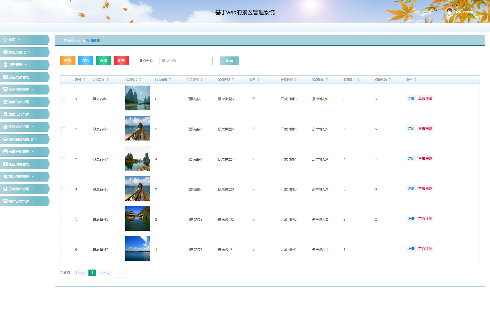
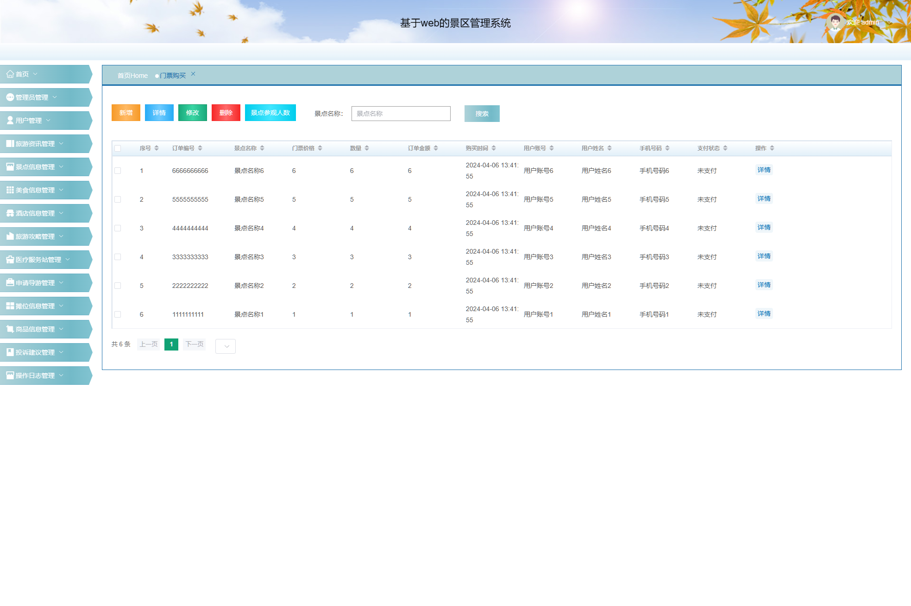

## 🌟 项目简介

这是一个基于 **Java + SpringBoot + Vue + MySQL** 构建的完整景区管理系统，功能持续优化中...

### 🧩 功能模块一览

- 用户登录注册（管理员·商家·用户三角色；商家后台注册，用户前台注册带邮箱验证码）
- 景点信息管理（景点名称·景点图片·门票价格·门票链接·景点类型·视频·开放时间·路线推荐·景点介绍·景点地址·收藏数量·点击次数）
- 门票购买管理（订单编号·景点名称·门票价格·数量·订单金额·购买时间·用户账号·手机号码·支付状态，含景点参观人数统计）
- 旅游攻略管理（攻略标题·景点名称·游玩天数·行程路线·起点·终点·出行方式·攻略详情·酒店推荐·美食推荐·视频）
- 美食信息管理（美食名称·美食类型·口味·价格·推荐指数·人均消费·美食地址·美食详情·收藏数量·点击次数）
- 酒店信息与酒店预定管理（房间名称·房间类型·房间图片·房间地址·一晚价格·服务电话·房内设施；预定天数·总价·支付状态·审核状态·审核回复）
- 摊位信息与入住申请管理（摊位名称·封面·摊位地址·租金·面积·状态；租赁月数·总价·经营范围·产品信息·审核状态）
- 商品信息与商品购买管理（商品名称·品牌·规格·价格·数量·商品详情·商家账号·商品分类；订单编号·订单金额·支付状态）
- 医疗服务站管理（服务站名称·封面·服务站地址·联系方式·服务时间·服务范围）
- 申请导游管理（订单编号·景点名称·导游语言·申请时间·用户账号·审核回复）
- 投诉建议管理（标题·内容·反馈时间·用户账号·手机号码·审核状态·审核回复）
- 景点类型·酒店类型·美食类型·商品分类字典管理与旅游资讯管理
- 景点·酒店·美食·商品评论管理（用户评论·管理员回复）与我的收藏、轮播图管理
- 商家与用户管理（账号·姓名·头像·性别·手机号码·身份证·邮箱）、操作日志管理（操作人·操作内容·参数·时间·IP）、修改密码

### 🖼️ 界面预览

|  |  |  |
|--------------------------|--------------------------|--------------------------|
|  |  |  |

---

## ⚙️ 运行环境与工具要求

为了确保项目顺利运行，请确认您的开发环境满足以下条件：

### ✅ 推荐配置
- **Java**: JDK 1.8  
- **MySQL**: 8.0.41  
- **Node.js**: 16.20.2  

⚠️ *温馨提示：版本不一致可能导致依赖冲突或启动失败。*

### 🛠️ 开发工具推荐
- **后端开发**: IntelliJ IDEA 2022+  
- **前端开发**: VS Code  
- **数据库管理**: Navicat / DBeaver / MySQL Workbench  ...

---

## 📥 项目更新下载地址

本项目会持续更新，更新后的完整包优先同步到这里，建议保存备用：

下载地址：[https://pan.xunlei.com/s/VP227lcQ5MQfcByZEA3oKunYA1?pwd=b2f2#](https://pan.xunlei.com/s/VP227lcQ5MQfcByZEA3oKunYA1?pwd=b2f2#)

提取码：`b2f2`

> 链接失效或需要最新版本：通过微信公众号 **【斯内普的数字坩埚】** 获取。

---

## 📲 获取更多帮助和服务

### 🔍 联系我们
关注公众号【斯内普的数字坩埚】即可获取：

- 其它免费的项目程序  
- 远程部署服务和讲解  
- 定制、二开、UI优化
- 微信/QQ 联系方式  

📷 扫码关注👇  

---

